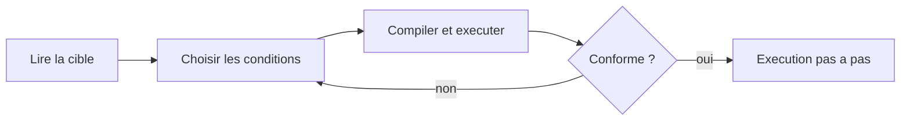

# Fiche projet — Atelier « boucles sans IA »

2026-09-20 · Demandé par @Someone

## Contexte et objectif

Le projet fournit une application web qui enseigne les boucles à des débutants, conçue pour que le copier-coller dans une IA n'apporte aucun avantage.

Les exercices classiques (« écris une pyramide en étoiles ») sont résolus en une seconde par un assistant IA. L'élève obtient le code sans construire le raisonnement.

La réponse est de déplacer la tâche : au lieu de *produire* du code, l'élève *lit et comprend l'exécution*. Trois leviers rendent la triche inutile :

- Prédire la sortie avant d'exécuter, puis vérifier.
- Compléter des conditions de boucle plutôt qu'écrire tout le code.
- Tirer la taille au hasard, pour que la cible diffère d'un poste à l'autre.

## Public cible et besoin

Utilisateur principal : un enseignant en programmation qui anime un cours d'initiation.

Apprenants : débutants complets, en Python puis en C. Aucun prérequis au-delà de la notion de variable.

Contexte d'usage : en classe, projeté au tableau ou utilisé poste par poste. L'outil doit fonctionner sans installation ni compte.

## Périmètre fonctionnel

L'outil regroupe plusieurs modes d'exercice, chacun centré sur la lecture de l'exécution plutôt que sur la production de code.

| Mode | Ce que fait l'élève | Levier anti-IA |
| --- | --- | --- |
| Prédire la sortie | Écrit le résultat attendu avant d'exécuter | La tâche est de lire, pas de produire |
| Trouver le bug | Identifie l'erreur dans une boucle donnée | Exige de comprendre le défaut |
| Remettre dans l'ordre (Parsons) | Réordonne des lignes mélangées | Impossible à « générer » |
| Compléter le code | Choisit les bonnes conditions de boucle | Un menu ne se colle pas dans une IA |
| Exécution pas à pas | Regarde variables et sortie évoluer tour par tour | Construit le modèle mental |

Chaque mode propose une régénération aléatoire (taille ou valeur) et un compteur de réussite.

## Détail des exercices

### Version Python (initiation)

Trois modes génériques sur des boucles simples : `for`, `while`, accumulateur, compteur. Les exercices sont générés avec des valeurs aléatoires.

- Prédire la sortie, avec table d'exécution animée à la révélation.
- Trouver le bug : borne exclue, boucle infinie, indentation, condition inversée, réinitialisation dans la boucle.
- Parsons : somme, compte à rebours, carrés, table.

### Version C (boucles imbriquées)

Huit motifs à reconstruire en complétant les conditions. Pour la ligne `i` (à partir de 0), voici les formules attendues :

| Motif | Espaces | Étoiles / contenu |
| --- | --- | --- |
| Carré | 0 | `n` |
| Triangle rectangle | 0 | `i + 1` |
| Triangle inversé | 0 | `n - i` |
| Triangle aligné à droite | `n - 1 - i` | `i + 1` |
| Losange (2·h lignes, L symétrique) | `h - 1 - L` | `2 * (L + 1)` |
| Pyramide (groupes « \* ») | `n - 1 - i` | `i + 1` groupes |
| Carré magique (if de bord) | — | `*` si bord, sinon `o` |
| Table de multiplication | — | `v * k`, k de 1 à 9, `v` lu au clavier |

Le carré magique introduit le `if` ; la table introduit `scanf` et une entrée utilisateur.

## Spécifications techniques

Contrainte centrale : chaque livrable est un fichier HTML autonome, sans backend ni étape de build.

- Stack : HTML, CSS et JavaScript vanilla, aucun framework.
- Dépendances externes : uniquement Google Fonts. Aucun script tiers, aucun appel réseau.
- Thèmes : clair et sombre, suivant le réglage système, avec bascule manuelle (utile au vidéoprojecteur).
- Persistance : seulement la préférence de thème (`localStorage`, encadré d'un `try/catch`). Aucune donnée élève stockée.
- Accessibilité : focus clavier visible, `prefers-reduced-motion` respecté, contrastes soignés.
- Responsive : du mobile au grand écran ; le code et les grilles défilent horizontalement si besoin.

## Architecture et structure du code

Le cœur est un moteur d'exercices piloté par des données : chaque exercice est un objet décrivant sa cible, son code à trous et sa logique de génération. Le rendu est séparé du contenu.

Modèle d'un exercice (version C) :

- `name`, `brief`, `why` : libellés affichés.
- `dim` / `value` : taille tirable (`n`, `h`) ou valeur saisie.
- `blanks` : les menus à compléter ; chaque option porte son texte C et une fonction JS équivalente.
- `tpl(n)` : le gabarit de code, mélange de texte et de marqueurs de trou.
- `rows(n, v, getFn)` : produit chaque ligne à partir des fonctions choisies ; sert à la fois à la cible (choix corrects) et à la sortie de l'élève.

Cycle d'un exercice :

La comparaison se fait ligne à ligne, après suppression des espaces de fin, et surligne les écarts.

## État actuel

Deux applications fonctionnelles sont livrées et vérifiées : chaque motif reproduit exactement la sortie attendue.

| Livrable | Langage enseigné | Modes | Lien |
| --- | --- | --- | --- |
| Atelier des boucles | Python | Prédire, bug, Parsons | [ouvrir](https://claude.ai/artifact/P5U4Zk6FoFDyU1D3DXJXSE) |
| Motifs en C | C | Compléter + trace, 8 motifs | [ouvrir](https://claude.ai/artifact/CEoJAa2CicKiEZj8r1yBYd) |

Les deux partagent le même système de design (typographies, thèmes, compteur) mais restent des fichiers indépendants.

## Évolutions et backlog

Pistes classées par priorité décroissante. L'effort est indicatif (S = petit, M = moyen).

| Priorité | Évolution | Détail | Effort |
| --- | --- | --- | --- |
| Haute | Mode « prédire » en C | Donner le code rempli, l'élève écrit le motif | M |
| Haute | Version imprimable | Fiches papier générées depuis les mêmes exercices | M |
| Moyenne | Boucles imbriquées libres | Motifs personnalisés pour élèves avancés | M |
| Moyenne | Sauvegarde de progression | Suivi local par élève, sans compte | S |
| Basse | Export des scores | CSV pour l'enseignant | S |
| Basse | Internationalisation | Textes séparés pour d'autres langues | M |

Mutualiser le moteur des deux applis dans un fichier partagé faciliterait ces ajouts.

## Critères d'acceptation

Un exercice ou un mode est considéré terminé quand :

- [ ] La sélection correcte reproduit exactement la cible, à toutes les tailles proposées.
- [ ] Une sélection incorrecte est signalée ligne par ligne, sans faux positif.
- [ ] La régénération aléatoire donne une cible différente sans casser la correction.
- [ ] L'exécution pas à pas reflète les choix courants de l'élève, même erronés.
- [ ] L'interface reste lisible en thème clair et sombre, du mobile au grand écran.
- [ ] Aucun appel réseau hors polices ; le fichier s'ouvre hors ligne.

## Contraintes, risques et maintenance

Autonomie du fichier : tout ajout doit rester dans un seul HTML, sans dépendance tierce hors Google Fonts.

Robustesse anti-triche : les menus limitent les réponses, donc un élève peut tester les combinaisons. La valeur pédagogique vient de la prédiction et de l'oral, à cadrer par l'enseignant.

Limites connues :

- La pyramide et les motifs à espaces retirent les espaces de fin lors de la comparaison.
- Le moteur ne compile pas réellement le C : il simule chaque motif par une fonction JS dédiée. Ajouter un motif exige d'écrire sa fonction `rows`.
- Duplication entre les deux applis tant que le moteur n'est pas mutualisé.
