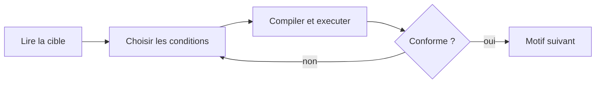

<p align="center">
  
</p>

------------------------------------------------------------------------------------------------------
🎯 PROJET ARCHITECTURE SI — Atelier « boucles sans IA »
------------------------------------------------------------------------------------------------------

Cet atelier construit, déploie et exploite une application web qui enseigne les **boucles imbriquées en C** à des débutants, conçue pour que le copier-coller dans une IA n'apporte aucun avantage.

Les exercices classiques (« écris une pyramide en étoiles ») sont résolus en une seconde par un assistant IA : l'élève obtient le code sans construire le raisonnement. La réponse retenue ici est de **déplacer la tâche** — au lieu de *produire* du code, l'élève *lit et comprend l'exécution*. Quatre leviers rendent la triche sans intérêt :

- **Compléter des conditions de boucle** plutôt qu'écrire tout le code : un menu déroulant ne se colle pas dans une IA.
- **Tirer la taille au hasard**, pour que la cible diffère d'un poste à l'autre.
- **Corriger côté serveur** : le navigateur ne reçoit jamais la réponse attendue.
- **Surveiller la fenêtre** : sortir de l'épreuve pour aller consulter un assistant coûte des points.

L'atelier a donc deux faces. Côté **enseignant**, vous apprenez la chaîne d'industrialisation continue : dépôt Git, hébergement, déploiement automatisé. Côté **pédagogique**, vous disposez à l'arrivée d'un outil de classe réellement utilisable.

**Architecture cible**  

  

### Public visé

**Utilisateur principal :** un enseignant en programmation qui anime un cours d'initiation.

**Apprenants :** débutants complets. Aucun prérequis au-delà de la notion de variable.

**Contexte d'usage :** en classe, poste par poste, avec l'énoncé projeté au tableau. Côté étudiant, aucune installation ni compte n'est nécessaire — un nom, un prénom et un code de session suffisent.

-------------------------------------------------------------------------------------------------------
🧩 Séquence 1 : GitHUB
-------------------------------------------------------------------------------------------------------
Objectif : Création d'un Repository GitHUB pour travailler avec son projet  
Difficulté : Très facile (~10 minutes)
-------------------------------------------------------------------------------------------------------
**Faites un Fork de ce projet**. Si besoin, voici une vidéo d'accompagnement pour vous aider à "Forker" un Repository Github : [Forker ce projet](https://youtu.be/p33-7XQ29zQ)  

---------------------------------------------------
🧩 Séquence 2 : Création d'un site chez Pythonanywhere
---------------------------------------------------
Objectif : Créer un hébergement sur Pythonanywhere  
Difficulté : Faible (~10 minutes)
---------------------------------------------------

Rendez-vous sur **https://www.pythonanywhere.com/** et créez vous un compte.  
  
---------------------------------------------------------------------------------------------
🧩 Séquence 3 : Les Actions GitHUB (Industrialisation Continue)
---------------------------------------------------------------------------------------------
Objectif : Automatiser la mise à jour de votre hébergement Pythonanywhere  
Difficulté : Moyenne (~15 minutes)
---------------------------------------------------------------------------------------------
Dans le Repository GitHUB que vous venez de créer précédemment lors de la séquence 1, vous avez un fichier intitulé deploy-pythonanywhere.yml et qui est déposé dans le répertoire .github/workflows. Ce fichier a pour objectif d'automatiser le déploiement de votre code sur votre site Pythonanywhere. Pour information, c'est ce que l'on appel des Actions GitHUB. Ce sont des scripts qui s'exécutent automatiquement lors de chaque Commit dans votre projet (C'est à dire à chaque modification de votre code). Ces scripts (appelés actions) sont au format yml qui est un format structuré proche de celui d'XML.  

Pour utiliser cette Action (deploy-pythonanywhere.yml), **vous avez besoin de créer des secrets dans GitHUB** afin de ne pas divulguer des informations sensibles aux internautes de passage dans votre Repository comme vos login et password par exemple.  

Pour cet atelier, **vous avez 7 secrets à créer** dans votre Repository GitHUB : **Settings → Secrets and variables → Actions → New repository secret**

Les quatre premiers servent à **déployer** :

**PA_USERNAME** = votre username PythonAnywhere.  
**PA_TOKEN** = votre API token. Token à créer dans pythonanywhere (Acount → API Token).  
**PA_TARGET_DIR** = Web → Source code (ex: /home/monuser/myapp).  
**PA_WEBAPP_DOMAIN** = votre site (ex: monuser.pythonanywhere.com).  

Les trois suivants **configurent l'application** elle-même. Le rôle de chacun est détaillé en séquence 4 :

**ATELIER_SECRET_KEY** = une chaîne aléatoire, 32 caractères minimum.  
**ATELIER_ADMIN_USER** = votre identifiant enseignant.  
**ATELIER_ADMIN_PASSWORD** = votre mot de passe enseignant.  

💡 Le workflow refuse de déployer tant qu'un de ces 7 secrets manque, est vide ou est mal formé. Il vous dira lequel et pourquoi, dans le log de l'Action. **Créez-les tous les 7 maintenant**, sinon votre premier déploiement échouera.
  
**Dernière étape :** Pour engager l'automatisation de votre première Action, vous devez cliquer sur le gros boutton vert dans l'onglet supérieur [Actions] dans votre Repository Github. Le boutton s'intitule "I understand my workflows, go ahead and enable them"   

Notions acquises de cette séquence :  
Vous avez vu dans cette séquence comment créer des secrets GiHUB afin de mettre en place de l'industrialisation continue.   

---------------------------------------------------
🗺️ Séquence 4 : Mise en service
---------------------------------------------------
Objectif : Configurer l'application et ouvrir votre première session  
Difficulté : Faible (~10 minutes)
---------------------------------------------------
L'application lit sa configuration dans des variables d'environnement. Vous n'avez rien à saisir sur PythonAnywhere : **elles sont produites à partir des secrets GitHub créés en séquence 3**.

| Secret GitHub | Rôle | Obligatoire |
| --- | --- | --- |
| `ATELIER_SECRET_KEY` | Signe les cookies de session. Sans elle, n'importe qui peut forger un cookie d'enseignant et prendre la main sur vos sessions. | oui, 32 caractères minimum |
| `ATELIER_ADMIN_USER` | Votre identifiant enseignant | oui |
| `ATELIER_ADMIN_PASSWORD` | Votre mot de passe enseignant | oui |
| `ATELIER_DATABASE` | Chemin du fichier SQLite | non, défaut `instance/atelier.sqlite` |
| `ATELIER_TRUST_PROXY` | Mettre à `0` pour ignorer les en-têtes de proxy. À laisser tel quel sur PythonAnywhere : sans cela le lien de session serait fabriqué en `http://`. | non, actif par défaut |

Pour générer la clé : `python3 -c "import secrets; print(secrets.token_urlsafe(32))"`.

⚠️ **Générez-la une fois et n'y touchez plus.** La changer invalide tous les cookies d'un coup : si vous la régénérez pendant une épreuve, toute la classe est déconnectée et doit se réidentifier.

### Comment les secrets arrivent jusqu'à l'application

PythonAnywhere n'expose aucune API pour les variables d'environnement. Le workflow contourne cette limite : à chaque déploiement, l'étape **Upload environment file** écrit un fichier `.env` à partir des secrets et le dépose à côté de l'application. Au démarrage, `create_app()` le lit.

```
Secrets GitHub  ──►  .env généré par le workflow  ──►  create_app() au démarrage
```

Trois conséquences à connaître :

- **Le `.env` n'est jamais dans le dépôt** : il est fabriqué au moment du déploiement et `.gitignore` l'exclut. Vos mots de passe ne partent donc pas sur GitHub en clair.
- **Il est réécrit à chaque push.** Le modifier à la main sur PythonAnywhere ne sert à rien : passez par les secrets.
- **Une vraie variable d'environnement reste prioritaire.** Si vous déclarez malgré tout quelque chose dans **Web → Environment variables**, ou un `export` en local, c'est cette valeur qui gagne. Pratique pour un test ponctuel sans toucher aux secrets.

### Ouvrir votre première session

1. Rendez-vous sur `/admin/login` et connectez-vous avec `ATELIER_ADMIN_USER` / `ATELIER_ADMIN_PASSWORD`.
2. Créez une session : donnez-lui un intitulé et cochez les exercices. Ils sont **groupés par module puis par niveau**, avec un bouton pour cocher un module ou un niveau entier. Un compteur indique combien de points vaut chaque exercice retenu. Les exercices de diagnostic affichent ici le nom de leur défaut, que l'élève ne voit pas.
3. Cliquez sur **Lancer la session**.
4. Copiez le **lien à transmettre** et envoyez-le à vos étudiants. Le code y est déjà : ils n'ont que leur nom et leur prénom à saisir. Le code reste affiché à côté si vous préférez le dicter.
5. Suivez leurs réponses en direct sur la même page.
6. Cliquez sur **Terminer la session** : les notes sont figées et la session bascule dans l'historique.


---------------------------------------------------
🔹 Séquence 5 : Exercices
---------------------------------------------------
Objectif : Travailler..  
Difficulté : Moyenne (~60 minutes)
---------------------------------------------------
**Exercice 1 : Création d'une nouvelle fonctionnalité**    
Créer une nouvelle route dans votre application afin de faire une recherche sur la base du nom d'un client.  
Cette fonctionnalité sera accéssible via la route suivante : **/fiche_nom/**  

**Exercice 2 : Protection**  
Cette nouvelle route "/fiche_nom/" est soumise à un contrôle d'accès User. C'est à dire différent des login et mot de passe administrateur.  
Pour accéder à cette fonctionnalité, l'utilisateur sera authentifié sous les login et mot de passe suivant : **user/12345**
  
---------------------------------------------------
🔹 Séquence 6 : Atelier
---------------------------------------------------
Objectif : Créer une application de biliothèque  
Difficulté : Moyenne (~180 minutes)
---------------------------------------------------
...  

---------------------------------------------------
📘 Référence : l'application
---------------------------------------------------

### Ce que fait l'application

Une épreuve surveillée sur les **boucles en C**. L'étudiant ne produit pas de code : il complète les conditions de boucle dans des menus, puis « compile » pour comparer sa sortie au motif cible.

Les exercices sont organisés en **modules**. Un module porte un titre, un niveau indicatif et un résumé ; il regroupe des exercices qui gardent chacun leur propre niveau, plus fin.

Un seul module existe aujourd'hui — **Les boucles**, dix-huit exercices — mais la structure est prévue pour en accueillir d'autres : les conditions, les tableaux, des quiz.

| Niveau | Exercices du module « Les boucles » |
| --- | --- |
| ●○○○ Découverte | Une ligne d'étoiles, Compte à rebours |
| ●●○○ Facile | Le pas de la boucle, La boucle while, Carré, Triangle rectangle, Triangle inversé, Bug : le triangle rectangle, Bug : la ligne d'étoiles |
| ●●●○ Moyen | Triangle aligné à droite, Pyramide, Carré magique, Table de multiplication, Bug : les n lignes, Bug : la somme de 1 à n, Prédire : triangle aligné à droite |
| ●●●● Avancé | Losange, Prédire : carré magique |

**Ajouter un module** tient en une entrée dans `MODULES` :

```python
Module(key="conditions", title="Les conditions", level=2,
       summary="…", keys=("si_simple", "si_sinon", …))
```

Trois tests veillent sur la cohérence : chaque exercice appartient à exactement un module, toutes les clés citées existent, et chaque module porte un titre, un résumé et un niveau connu.

Trois modes coexistent :

| Mode | Ce que fait l'élève | Levier anti-IA |
| --- | --- | --- |
| **Compléter** (12) | Choisit les conditions de boucle dans des menus | Un menu déroulant ne se colle pas dans une IA |
| **Prédire** (2) | Écrit la sortie que produit un code donné entier | Il n'y a pas d'énoncé à copier, seulement un code à lire |
| **Trouver le bug** (4) | Désigne la cause de l'écart entre l'attendu et l'obtenu | Exige de comprendre le défaut, pas de produire du code |

**La taille de chaque motif est tirée au hasard par étudiant** : deux voisins n'ont pas la même cible. La correction est faite **côté serveur** — le navigateur ne reçoit jamais la réponse attendue.

### Surveillance de la fenêtre

L'épreuve s'ouvre en plein écran. Une « sortie » est tout passage hors de l'état surveillé : changement d'onglet, sortie du plein écran, ou perte du premier plan. À chaque sortie, un popup s'ouvre avec un décompte de 3 secondes.

| Sortie | Conséquence |
| --- | --- |
| 1<sup>re</sup> | Avertissement, aucun point retiré |
| 2<sup>e</sup> | &minus;2 points |
| 3<sup>e</sup> et suivantes | &minus;3 points |

Le décompte est un rappel à l'ordre : la pénalité dépend du rang de la sortie, pas du délai de retour. Ce délai est néanmoins enregistré et visible par l'enseignant.

Si le navigateur refuse le plein écran, la surveillance se rabat sur la détection du changement d'onglet et l'étudiant en est informé.

### Les exercices d'entrée

Quatre exercices sur la boucle simple, avant toute imbrication.

| Exercice | Ce qu'il fait travailler | Le trou |
| --- | --- | --- |
| Une ligne d'étoiles | Le principe même de la répétition | la condition d'arrêt |
| Compte à rebours | Un compteur qui descend : la borne change de camp | la condition d'arrêt |
| Le pas de la boucle | Nombre de tours ≠ valeurs prises par le compteur | le pas (`j++`, `j += 2`…) |
| La boucle while | L'incrément n'est plus automatique | ce qui fait avancer `j` |

Le dernier réserve un piège utile : l'option `j--` produit une **boucle infinie**. Le moteur la détecte (`InfiniteLoop`), n'essaie pas de produire une sortie, et la trace montre six tours puis « le test reste vrai : la boucle ne s'arrête jamais ».

Ces quatre exercices se distinguent des motifs sur deux points :

**Un rappel de cours** est affiché au-dessus de l'énoncé : les trois parties du `for`, le compteur qui part de zéro, le test évalué *avant* chaque tour.

**Une trace d'exécution** apparaît après chaque compilation. Elle déroule la boucle tour par tour — valeur de `j`, test avec ses valeurs substituées, verdict, action, sortie accumulée — et se termine sur le tour où le test devient faux :

| Tour | j | Test | | Action | Sortie |
| --- | --- | --- | --- | --- | --- |
| 6 | 5 | `5 <= 6` | ✓ vrai | `printf("*")` puis `j++` | `******` |
| 7 | 6 | `6 <= 6` | ✓ vrai | `printf("*")` puis `j++` | `*******` |
| — | 7 | `7 <= 6` | ✗ faux | on sort de la boucle | `*******` |

Le point essentiel : **la trace déroule le choix de l'élève, pas la réponse attendue.** Une borne fausse produit une trace fausse, et l'erreur de dépassement devient visible à la ligne près, au lieu de rester un « il y a une étoile de trop ».

Techniquement, un motif expose une trace en définissant `trace(params, get, text)` sur son `Pattern`. Les autres renvoient `None` et l'interface masque le tableau. Deux fabriques couvrent les cas courants : `condition_trace` quand le trou est la condition, `step_trace` quand c'est le pas. Un test vérifie que **la dernière ligne de la trace égale toujours la sortie produite**, pour chaque option et chaque taille.

### Le mode « prédire la sortie »

Le code est donné complet, sans trou. L'élève lit, déroule mentalement, et écrit le résultat dans une zone de texte.

C'est le mode le plus résistant à une IA : il n'y a pas d'énoncé à coller, seulement un code à comprendre. Et c'est le seul où **la cible ne descend jamais jusqu'au navigateur** tant qu'elle n'est pas trouvée :

- `/api/task/<clé>` renvoie `target: null` pour ces exercices ;
- une réponse fausse reçoit un verdict **ligne par ligne sur ce que l'élève a écrit**, sans le contenu attendu, et sans même le nombre de lignes de la cible — seulement un indicateur « le compte ne correspond pas » ;
- la sortie attendue n'apparaît qu'une fois l'exercice réussi.

Les espaces de début comptent, ceux de fin sont ignorés, et les lignes vides finales sont retirées avant comparaison.

`predict_from()` dérive un exercice de prédiction à partir de n'importe quel motif existant : il remplit les trous avec la sélection de référence et bascule le mode. Ajouter une prédiction sur un nouveau motif tient en cinq lignes.

### Le mode « trouver le bug »

Un code fautif, la sortie qu'il **devrait** produire, celle qu'il produit **réellement**, et quatre causes possibles. L'écart est sous les yeux : ce qui fait l'exercice, c'est de l'expliquer.

| Exercice | Le défaut *(réservé à l'enseignant)* | Ce qu'on observe |
| --- | --- | --- |
| Bug : le triangle rectangle | `j < i` au lieu de `j <= i` | Première ligne vide, une étoile manque partout |
| Bug : la ligne d'étoiles | `j > n` au lieu de `j < n` | Rien du tout : le test est faux dès le premier passage |
| Bug : les n lignes | Accolades manquantes : une seule instruction dans la boucle | Toutes les étoiles sur une seule ligne |
| Bug : la somme de 1 à n | `total = 0` **dans** la boucle | Le résultat vaut le dernier terme, pas la somme |

**Le nom de l'exercice désigne le but du programme, jamais son défaut.** Un titre comme « la borne exclue » donnerait la réponse avant lecture. Le nom du défaut part dans `teacher_note`, que seul le formulaire de composition affiche — un test vérifie qu'il ne descend jamais dans la réponse envoyée à l'élève.

Chaque cause porte sa propre explication, affichée après le choix — y compris les mauvaises. Choisir « la condition devrait être `i <= n` » sur les accolades manquantes répond : *« Non : le nombre d'étoiles est correct. C'est leur répartition en lignes qui ne l'est pas. »* Le retour est donc utile même quand l'élève se trompe.

Les diagnostics sont des phrases, pas du code : ils s'affichent en boutons radio, et leur ordre est mélangé par étudiant. Deux tests vérifient que chaque exercice présente bien un écart visible à **toutes** les tailles tirables, et que chaque option porte une explication.

`debug_pattern()` construit un tel exercice à partir de son gabarit fautif, d'une fonction pour la sortie attendue, d'une autre pour la sortie obtenue, et des quatre diagnostics.

### Les huit motifs imbriqués

Pour la ligne `i` (à partir de 0), voici les formules attendues. L'étudiant ne les écrit pas : il les reconnaît parmi quatre propositions par menu.

| Motif | Espaces | Étoiles / contenu |
| --- | --- | --- |
| Carré | 0 | `n` |
| Triangle rectangle | 0 | `i + 1` |
| Triangle inversé | 0 | `n - i` |
| Triangle aligné à droite | `n - 1 - i` | `i + 1` |
| Losange (2·h lignes, L symétrique) | `h - 1 - L` | `2 * (L + 1)` |
| Pyramide (groupes « \* ») | `n - 1 - i` | `i + 1` groupes |
| Carré magique (if de bord) | — | `*` si bord, sinon `o` |
| Table de multiplication | — | `v * k`, k de 1 à 9, `v` lu au clavier |

Le carré magique introduit le `if` ; la table introduit `scanf` et une entrée utilisateur.

L'enseignant choisit à la création de la session quels motifs composent l'épreuve.

### Modèle d'un exercice

Le cœur est un moteur piloté par des données : chaque exercice est un objet décrivant sa cible, son code à trous et sa logique de génération. Le rendu est séparé du contenu.

- `name`, `brief`, `why` : libellés affichés à l'élève.
- `teacher_note` : mention réservée au formulaire de composition.
- `lesson` : rappel de cours facultatif, affiché au-dessus de l'énoncé.
- `dim` / `value` : taille tirable (`n`, `h`) ou valeur saisie (`v`).
- `blanks` : les menus à compléter ; chaque option porte son texte C et la fonction Python équivalente.
- `tpl` : le gabarit de code, mélange de texte et de marqueurs de trou.
- `rows(params, get)` : produit chaque ligne à partir des fonctions choisies ; sert à la fois à la cible (choix de référence) et à la sortie de l'élève.
- `broken(params)` : en mode diagnostic, la sortie que produit réellement le code fautif.
- `trace(params, get, text)` : déroulé pas à pas facultatif, pour les exercices qui enseignent le mécanisme plutôt que le motif.

Une sélection est donc juste **exactement quand elle reproduit la cible** : il n'y a pas de table de bonnes réponses à maintenir en parallèle du moteur.

Cycle d'un exercice :



La comparaison se fait ligne à ligne, après suppression des espaces de fin, et surligne les écarts.

### Barème

`note = 20 × (motifs réussis / motifs de la session) − pénalités`, bornée à l'intervalle [0, 20]. Les motifs pèsent tous le même poids ; le nombre de tentatives n'entre pas dans la note, mais il est affiché à l'enseignant.

### Routes

| Route | Accès | Rôle |
| --- | --- | --- |
| `/` | public | Identification (nom, prénom, code de session) |
| `/s/<code>` | public | **Lien à transmettre** : le code y est déjà, l'élève ne saisit que son identité |
| `/exercice` | étudiant | L'épreuve |
| `/termine` | étudiant | Copie remise et détail de la note |
| `/admin/login` | public | Connexion enseignant |
| `/admin/` | enseignant | Créer une session, lister celles en cours |
| `/admin/sessions/<id>` | enseignant | Lancer, suivre en direct, terminer |
| `/admin/historique` | enseignant | Sessions closes, moyennes, export |
| `/admin/sessions/<id>/export.csv` | enseignant | Notes au format CSV (séparateur `;`) |

### Structure du code

```
flask_app.py            Point d'entrée WSGI
design/                 Sources graphiques, exclues du déploiement
outils/logo.py          Régénère les déclinaisons du logo
atelier/
  __init__.py           Fabrique d'application et configuration
  db.py                 Connexion SQLite, une par requête
  schema.sql            Schéma (session, student, task, incident)
  exercises.py          Moteur des 8 motifs : gabarits, menus, correction
  scoring.py            Barème et table des pénalités
  student.py            Parcours étudiant et API
  admin.py              Espace enseignant, suivi direct, historique
  templates/            Gabarits Jinja
  static/
    css/style.css       Thème clair/sombre
    img/                Logo Evalio (clair et sombre), favicon
    js/proctor.js       Surveillance de la fenêtre
    js/exercise.js      Page d'exercice
    js/admin_live.js    Suivi direct (interrogation toutes les 3 s)
test_atelier.py         Tests de bout en bout
.env                    Genere par le deploiement, jamais versionne
```

**Ajouter un motif** se fait dans `exercises.py` : un objet `Pattern` décrit son gabarit, ses menus et sa fonction `rows`. Rien d'autre à modifier.

### Spécifications techniques

- **Stack :** Python, Flask, SQLite. Côté navigateur, HTML, CSS et JavaScript vanilla — aucun framework, aucune étape de build.
- **Dépendances :** Flask uniquement (`requirements.txt`). La seule ressource externe chargée par le navigateur est Google Fonts.
- **Thèmes :** clair et sombre, suivant le réglage système, avec bascule manuelle (utile au vidéoprojecteur).
- **Persistance :** SQLite. Les copies, les sorties de fenêtre et les notes sont conservées — c'est ce qui rend l'historique possible. Côté navigateur, seul le thème est stocké (`localStorage`, encadré d'un `try/catch`).
- **Accessibilité :** focus clavier visible, `prefers-reduced-motion` respecté, statuts jamais portés par la couleur seule (toujours doublés d'un glyphe et d'une infobulle).
- **Responsive :** du mobile au grand écran ; le code et les grilles défilent horizontalement si besoin.

> **Note d'évolution.** La première version du projet visait un fichier HTML autonome, sans backend ni donnée élève stockée. L'ajout de l'identification, du suivi en direct, des sessions pilotées par l'enseignant et de l'historique a rendu un serveur indispensable : on ne peut ni noter de façon fiable, ni empêcher la lecture de la réponse attendue, ni consolider des résultats, depuis le seul navigateur.

### Identité visuelle

Le logo Evalio est affiché dans la barre de navigation de chaque page, en tête de la page d'identification, et sert de favicon.

| Fichier | Usage |
| --- | --- |
| `logo-evalio.png` | Verrouillage complet : page d'identification, et en tête de ce README |
| `logo-evalio-dark.png` | Idem, thème sombre |
| `logo-evalio-compact.png` | Barre de navigation |
| `logo-evalio-compact-dark.png` | Idem, thème sombre |
| `favicon.ico` | Favicon, 16 / 32 / 48 px |
| `apple-touch-icon.png` | Icône d'écran d'accueil iOS, 180 px |

*(tous dans `atelier/static/img/`, régénérés depuis `design/`)*

Les icônes sont produites depuis `design/Favicon.png`, le pictogramme seul fourni en 1254 px avec sa transparence. Le favicon reste transparent — l'onglet du navigateur le compose lui-même — tandis que l'icône iOS reçoit un fond blanc opaque : un PNG transparent y serait composé sur du noir, où le bleu marine de la toque disparaîtrait.

**Pourquoi un verrouillage compact.** La baseline « QUIZZES FOR A BRIGHTER YOU » mesure 35 px sur une source de 456 de haut. Affichée à 30 px dans la barre de navigation, elle tombe sous les 3 px et se réduit à une bavure. Le script détecte donc la baseline par analyse des bandes horizontales, la retire, et recompose pictogramme et mot-symbole côte à côte. Le verrouillage complet reste réservé aux grands formats.

**Deux fichiers plutôt qu'un filtre CSS.** Le bleu marine du mot-symbole serait illisible sur fond sombre, et un filtre d'inversion emporterait aussi le turquoise et le gris clair de la baseline. La variante sombre applique `L' = max(L, 1 − L)` à chaque pixel : aucun ne reste sombre, mais teinte et saturation sont conservées.

La bascule suit le réglage système **et** le choix manuel du visiteur, dans les deux sens : un thème clair imposé sur une machine en sombre affiche bien le logo clair.

La source haute définition vit dans `design/`, exclue du déploiement. Pour régénérer toutes les déclinaisons après avoir modifié le logo :

```bash
pip install Pillow          # dépendance du script uniquement, pas de l'application
python3 outils/logo.py
```

L'ensemble des visuels pèse 49 Ko.

### Pourquoi une interrogation périodique et pas de WebSocket

PythonAnywhere n'expose pas de WebSocket sur les comptes gratuits. Le suivi direct interroge donc `/admin/api/sessions/<id>/live` toutes les 3 secondes. La charge reste faible : une requête par enseignant connecté, pas par étudiant.

### Développement local

```bash
pip install -r requirements.txt
export ATELIER_SECRET_KEY=dev ATELIER_ADMIN_USER=prof ATELIER_ADMIN_PASSWORD=secret
flask --app flask_app run --debug
python3 -m unittest test_atelier -v     # 59 tests
```

---------------------------------------------------
✅ Critères d'acceptation
---------------------------------------------------

Un motif ou une fonctionnalité est considéré terminé quand :

- [x] La sélection correcte reproduit exactement la cible, à toutes les tailles proposées.
- [x] Aucune sélection incorrecte ne reproduit la cible (vérifié pour chaque distracteur, à chaque taille).
- [x] Une sélection incorrecte est signalée ligne par ligne, sans faux positif.
- [x] La régénération aléatoire donne une cible différente sans casser la correction.
- [x] La réponse attendue ne transite jamais jusqu'au navigateur.
- [x] Une sortie de fenêtre compte pour une seule pénalité, quel que soit le nombre d'événements émis par le navigateur.
- [x] La note est bornée à [0, 20] et figée à la clôture de la session.
- [x] L'interface reste lisible en thème clair et sombre, du mobile au grand écran.

La suite `test_atelier.py` couvre ces points (59 tests).

---------------------------------------------------
🚧 Évolutions et backlog
---------------------------------------------------

Pistes classées par priorité décroissante. L'effort est indicatif (S = petit, M = moyen).

| Priorité | Évolution | Détail | Effort |
| --- | --- | --- | --- |
| Haute | Plus de prédictions | `predict_from` sur les autres motifs, en une poignée de lignes | S |
| Moyenne | Plus de bugs | Boucle infinie, décalage d'indice, condition composée mal parenthésée | S |
| Moyenne | Mode Parsons | Réordonner des lignes mélangées : impossible à « générer » | M |
| Moyenne | Trace des boucles imbriquées | Étendre l'exécution pas à pas aux motifs à deux boucles | M |
| Moyenne | Version imprimable | Fiches papier générées depuis les mêmes exercices | M |
| Moyenne | Version Python d'initiation | Boucles simples : `for`, `while`, accumulateur, compteur | M |
| Basse | Boucles imbriquées libres | Motifs personnalisés pour élèves avancés | M |
| Basse | Internationalisation | Textes séparés pour d'autres langues | M |

Chacun de ces modes s'ajoute dans `exercises.py` sans toucher au reste : le moteur est déjà séparé du contenu.

*Déjà livré depuis la fiche initiale :* modes « prédire la sortie » et « trouver le bug », identification des élèves, suivi de progression, sessions pilotées par l'enseignant, notation sur 20, historique et export CSV des scores, exercice d'entrée avec exécution pas à pas.

---------------------------------------------------
⚠️ Contraintes, risques et limites connues
---------------------------------------------------

**Robustesse anti-triche.** Les menus limitent les réponses, donc un élève déterminé peut tester les combinaisons — quatre options par menu, une à deux menus par motif. Le nombre de tentatives est enregistré et affiché à l'enseignant, ce qui rend ce comportement visible. La valeur pédagogique vient de la prédiction et de l'oral : c'est à l'enseignant de la cadrer.

**Surveillance.** La détection de sortie s'appuie sur des événements du navigateur. Elle décourage la consultation d'un assistant dans un autre onglet ; elle ne protège ni d'un second écran, ni d'un téléphone. Si le navigateur refuse le plein écran, la surveillance se rabat sur le changement d'onglet et l'étudiant en est informé.

**Le moteur ne compile pas réellement le C.** Il simule chaque motif par une fonction Python dédiée. Ajouter un motif exige donc d'écrire sa fonction `rows` en même temps que son gabarit.

**Comparaison des sorties.** La pyramide et les motifs à espaces voient leurs espaces de fin supprimés avant comparaison : un écart portant uniquement sur ces espaces ne serait pas signalé.

**Échelle.** SQLite et l'interrogation périodique conviennent à une classe. Au-delà de quelques dizaines d'étudiants simultanés sur un compte PythonAnywhere gratuit, il faudrait revoir l'hébergement.

--------------------------------------------------------------------
🧠 Troubleshooting :
---------------------------------------------------
Objectif : Visualiser ses logs et découvrir ses erreurs
---------------------------------------------------
Lors de vos développements, vous serez peut-être confronté à des erreurs systèmes car vous avez faits des erreurs de syntaxes dans votre code, faits de mauvaises déclarations de fonctions, appelez des modules inexistants, mal renseigner vos secrets, etc…  
Les causes d'erreurs sont quasi illimitées. **Vous devez donc vous tourner vers les logs de votre système pour comprendre d'où vient le problème** :  

Vos log sont accéssible via les URL suivantes :  
* Access log : {site}.pythonanywhere.com.access.log
* Error log : {site}.pythonanywhere.com.error.log
* Server log: {site}.pythonanywhere.com.server.log
