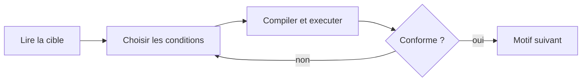

<p align="center">
  
</p>

------------------------------------------------------------------------------------------------------
🎯 PROJET ARCHITECTURE SI — Atelier « boucles sans IA »
------------------------------------------------------------------------------------------------------

Cet atelier construit, déploie et exploite une application web qui enseigne les **boucles imbriquées en C** à des débutants, conçue pour que le copier-coller dans une IA n'apporte aucun avantage.

Les exercices classiques (« écris une pyramide en étoiles ») sont résolus en une seconde par un assistant IA : l'élève obtient le code sans construire le raisonnement. La réponse retenue ici est de **déplacer la tâche** — au lieu de *produire* du code, l'élève *lit et comprend l'exécution*. Quatre leviers rendent la triche sans intérêt :

- **Compléter des conditions de boucle** plutôt qu'écrire tout le code : un menu déroulant ne se colle pas dans une IA.
- **Tirer la taille au hasard**, pour que la cible diffère d'un poste à l'autre.
- **Corriger côté serveur** : le navigateur ne reçoit jamais la réponse attendue.
- **Surveiller la fenêtre** : sortir de l'épreuve pour aller consulter un assistant coûte des points.

L'atelier a donc deux faces. Côté **enseignant**, vous apprenez la chaîne d'industrialisation continue : dépôt Git, hébergement, déploiement automatisé. Côté **pédagogique**, vous disposez à l'arrivée d'un outil de classe réellement utilisable.

**Architecture cible**  

  

### Public visé

**Utilisateur principal :** un enseignant en programmation qui anime un cours d'initiation.

**Apprenants :** débutants complets. Aucun prérequis au-delà de la notion de variable.

**Contexte d'usage :** en classe, poste par poste, avec l'énoncé projeté au tableau. Côté étudiant, aucune installation ni compte n'est nécessaire — un nom, un prénom et un code de session suffisent.

-------------------------------------------------------------------------------------------------------
🧩 Séquence 1 : GitHUB
-------------------------------------------------------------------------------------------------------
Objectif : Création d'un Repository GitHUB pour travailler avec son projet  
Difficulté : Très facile (~10 minutes)
-------------------------------------------------------------------------------------------------------
**Faites un Fork de ce projet**. Si besoin, voici une vidéo d'accompagnement pour vous aider à "Forker" un Repository Github : [Forker ce projet](https://youtu.be/p33-7XQ29zQ)  

---------------------------------------------------
🧩 Séquence 2 : Création d'un site chez Pythonanywhere
---------------------------------------------------
Objectif : Créer un hébergement sur Pythonanywhere  
Difficulté : Faible (~10 minutes)
---------------------------------------------------

Rendez-vous sur **https://www.pythonanywhere.com/** et créez vous un compte.  
  
---------------------------------------------------------------------------------------------
🧩 Séquence 3 : Les Actions GitHUB (Industrialisation Continue)
---------------------------------------------------------------------------------------------
Objectif : Automatiser la mise à jour de votre hébergement Pythonanywhere  
Difficulté : Moyenne (~15 minutes)
---------------------------------------------------------------------------------------------
Dans le Repository GitHUB que vous venez de créer précédemment lors de la séquence 1, vous avez un fichier intitulé deploy-pythonanywhere.yml et qui est déposé dans le répertoire .github/workflows. Ce fichier a pour objectif d'automatiser le déploiement de votre code sur votre site Pythonanywhere. Pour information, c'est ce que l'on appel des Actions GitHUB. Ce sont des scripts qui s'exécutent automatiquement lors de chaque Commit dans votre projet (C'est à dire à chaque modification de votre code). Ces scripts (appelés actions) sont au format yml qui est un format structuré proche de celui d'XML.  

Pour utiliser cette Action (deploy-pythonanywhere.yml), **vous avez besoin de créer des secrets dans GitHUB** afin de ne pas divulguer des informations sensibles aux internautes de passage dans votre Repository comme vos login et password par exemple.  

Pour cet atelier, **vous avez 7 secrets à créer** dans votre Repository GitHUB : **Settings → Secrets and variables → Actions → New repository secret**

Les quatre premiers servent à **déployer** :

**PA_USERNAME** = votre username PythonAnywhere.  
**PA_TOKEN** = votre API token. Token à créer dans pythonanywhere (Acount → API Token).  
**PA_TARGET_DIR** = Web → Source code (ex: /home/monuser/myapp).  
**PA_WEBAPP_DOMAIN** = votre site (ex: monuser.pythonanywhere.com).  

Les trois suivants **configurent l'application** elle-même. Le rôle de chacun est détaillé en séquence 4 :

**ATELIER_SECRET_KEY** = une chaîne aléatoire, 32 caractères minimum.  
**ATELIER_ADMIN_USER** = votre identifiant administrateur.  
**ATELIER_ADMIN_PASSWORD** = votre mot de passe administrateur.  

💡 Le workflow refuse de déployer tant qu'un de ces 7 secrets manque, est vide ou est mal formé. Il vous dira lequel et pourquoi, dans le log de l'Action. **Créez-les tous les 7 maintenant**, sinon votre premier déploiement échouera.
  
**Dernière étape :** Pour engager l'automatisation de votre première Action, vous devez cliquer sur le gros boutton vert dans l'onglet supérieur [Actions] dans votre Repository Github. Le boutton s'intitule "I understand my workflows, go ahead and enable them"   

Notions acquises de cette séquence :  
Vous avez vu dans cette séquence comment créer des secrets GiHUB afin de mettre en place de l'industrialisation continue.   

---------------------------------------------------
🗺️ Séquence 4 : Mise en service
---------------------------------------------------
Objectif : Configurer l'application et ouvrir votre première session  
Difficulté : Faible (~10 minutes)
---------------------------------------------------
L'application lit sa configuration dans des variables d'environnement. Vous n'avez rien à saisir sur PythonAnywhere : **elles sont produites à partir des secrets GitHub créés en séquence 3**.

| Secret GitHub | Rôle | Obligatoire |
| --- | --- | --- |
| `ATELIER_SECRET_KEY` | Signe les cookies de session. Sans elle, n'importe qui peut forger un cookie d'enseignant et prendre la main sur vos sessions. | oui, 32 caractères minimum |
| `ATELIER_ADMIN_USER` | Votre identifiant **administrateur**. C'est le compte qui crée les comptes des autres enseignants. | oui |
| `ATELIER_ADMIN_PASSWORD` | Votre mot de passe administrateur | oui |
| `ATELIER_DATABASE` | Chemin du fichier SQLite | non, défaut `instance/atelier.sqlite` |
| `ATELIER_TRUST_PROXY` | Mettre à `0` pour ignorer les en-têtes de proxy. À laisser tel quel sur PythonAnywhere : sans cela le lien de session serait fabriqué en `http://`. | non, actif par défaut |

Pour générer la clé : `python3 -c "import secrets; print(secrets.token_urlsafe(32))"`.

⚠️ **Générez-la une fois et n'y touchez plus.** La changer invalide tous les cookies d'un coup : si vous la régénérez pendant une épreuve, toute la classe est déconnectée et doit se réidentifier.

### Comment les secrets arrivent jusqu'à l'application

PythonAnywhere n'expose aucune API pour les variables d'environnement. Le workflow contourne cette limite : à chaque déploiement, l'étape **Upload environment file** écrit un fichier `.env` à partir des secrets et le dépose à côté de l'application. Au démarrage, `create_app()` le lit.

```
Secrets GitHub  ──►  .env généré par le workflow  ──►  create_app() au démarrage
```

Trois conséquences à connaître :

- **Le `.env` n'est jamais dans le dépôt** : il est fabriqué au moment du déploiement et `.gitignore` l'exclut. Vos mots de passe ne partent donc pas sur GitHub en clair.
- **Il est réécrit à chaque push.** Le modifier à la main sur PythonAnywhere ne sert à rien : passez par les secrets.
- **Une vraie variable d'environnement reste prioritaire.** Si vous déclarez malgré tout quelque chose dans **Web → Environment variables**, ou un `export` en local, c'est cette valeur qui gagne. Pratique pour un test ponctuel sans toucher aux secrets.

### Ouvrir votre première session

1. Rendez-vous sur `/admin/login` et connectez-vous avec `ATELIER_ADMIN_USER` / `ATELIER_ADMIN_PASSWORD`.
2. *(facultatif)* Si vous êtes plusieurs à utiliser l'installation : onglet **Comptes**, créez un compte par collègue. Format détaillé plus bas.
3. *(facultatif)* Pour ajouter vos propres QCM : carte **Importer un QCM**, bouton **Télécharger le modèle**, remplissez-le, redéposez-le. Le sous-module apparaît aussitôt sous le chapitre **QCM**. Format détaillé plus bas.
4. Créez une session : donnez-lui un intitulé et cochez les exercices. **Le formulaire arrive entièrement décoché** : une épreuve se compose, elle ne se subit pas. Les exercices sont **groupés par chapitre, module puis niveau**, avec un bouton pour cocher un chapitre, un module ou un niveau entier. Un compteur indique combien de points vaut chaque exercice retenu. Les exercices de diagnostic affichent ici le nom de leur défaut, que l'élève ne voit pas.
   Chapitres et modules **se replient** : le catalogue se parcourt sans dérouler une centaine d'intitulés, et chaque en-tête replié affiche le compte de ses exercices cochés. Les plis suivent l'enseignant d'une visite à l'autre.
   Un clic sur le **titre d'un exercice** ouvre sa fiche : voir plus bas.
   À côté de l'intitulé, la case **Mode examen** décide de ce que l'élève verra de ses résultats : voir plus bas.
5. Cliquez sur **Lancer la session**.
6. Copiez le **lien à transmettre** et envoyez-le à vos étudiants. Le code y est déjà : ils n'ont que leur nom et leur prénom à saisir. Le code reste affiché à côté si vous préférez le dicter.
7. Suivez leurs réponses en direct sur la même page.
8. Cliquez sur **Terminer la session** : les notes sont figées et la session bascule dans l'historique.


---------------------------------------------------
🔹 Séquence 5 : Exercices
---------------------------------------------------
Objectif : Travailler..  
Difficulté : Moyenne (~60 minutes)
---------------------------------------------------
**Exercice 1 : Création d'une nouvelle fonctionnalité**    
Créer une nouvelle route dans votre application afin de faire une recherche sur la base du nom d'un client.  
Cette fonctionnalité sera accéssible via la route suivante : **/fiche_nom/**  

**Exercice 2 : Protection**  
Cette nouvelle route "/fiche_nom/" est soumise à un contrôle d'accès User. C'est à dire différent des login et mot de passe administrateur.  
Pour accéder à cette fonctionnalité, l'utilisateur sera authentifié sous les login et mot de passe suivant : **user/12345**
  
---------------------------------------------------
🔹 Séquence 6 : Atelier
---------------------------------------------------
Objectif : Créer une application de biliothèque  
Difficulté : Moyenne (~180 minutes)
---------------------------------------------------
...  

---------------------------------------------------
📘 Référence : l'application
---------------------------------------------------

### Ce que fait l'application

Une épreuve surveillée sur les **bases de la programmation et du système**. L'étudiant ne produit ni code ni commande : il complète des menus, puis lance l'exécution pour comparer sa sortie au motif cible.

Le catalogue a trois étages : **chapitre → module → exercice**.

Un **chapitre** réunit des modules d'un même domaine. Un **module** porte un titre, un niveau indicatif et un résumé. Chaque **exercice** garde son propre niveau, plus fin, et son mode.

Trois chapitres aujourd'hui : **Langage C** et **Ligne de commande Linux**, tous deux décrits en Python dans `atelier/modules/`, et **QCM**, qui accueille en plus des modules **importés au format Excel** depuis la console (voir **Le chapitre QCM**).

**55 exercices de C** répartis en six modules :

| Module | Niveau | Exercices | Ce qu'il fait travailler |
| --- | --- | --- | --- |
| Les boucles | ●○○○ | 18 | Répétition, compteur, condition d'arrêt, pas, motifs imbriqués |
| Les conditions | ●○○○ | 8 | Comparaisons, `&&` / `\|\|`, `if … else if`, `switch` |
| Les chaînes de caractères | ●●○○ | 8 | Tableau de `char`, `'\0'`, indices, comparaison de caractères |
| Les tableaux | ●●○○ | 8 | Parcours indexé, accumulateurs, extremums, deux boucles |
| Les arguments | ●●○○ | 7 | `argc`, `argv`, `atoi`, et le piège de `argv[0]` |
| Itératif et récursif | ●●●○ | 6 | Cas d'arrêt, pas, débordement de pile |

**28 exercices de Linux** répartis en quatre modules :

| Module | Niveau | Exercices | Ce qu'il fait travailler |
| --- | --- | --- | --- |
| Fichiers et dossiers | ●○○○ | 8 | `pwd`, `cd`, `ls -a`, `wc`, `head` / `tail`, `cp` / `mv`, `>` et `>>` |
| Filtrer, trier, compter | ●●○○ | 7 | `grep`, `cut`, `sort`, `uniq`, et le tube qui les enchaîne |
| Droits et recherche | ●●●○ | 6 | `ls -l`, `chmod` octal et symbolique, `find`, `-delete` |
| Le shell | ●●●● | 7 | `$1` et `$#`, `&&` / `\|\|`, `for`, les étoiles, `sed`, `awk` |

**83 exercices de C et de Linux**, plus les 15 questions du QCM livré.

**Ajouter un module** tient en trois gestes : un fichier dans `atelier/modules/`, son import dans `atelier/exercises.py`, et son entrée dans un chapitre. **Ajouter un QCM** ne demande pas de code du tout : un classeur Excel déposé depuis la console suffit.

```python
# atelier/modules/pointeurs.py
PATTERNS = (ADRESSE, DEREFERENCE, …)
MODULE = Module(key="pointeurs", title="Les pointeurs", level=4,
                summary="…", keys=tuple(p.key for p in PATTERNS))
```

Un chapitre nomme aussi le geste qui valide une réponse : on **compile** un programme, on **exécute** une commande. C'est le champ `action` du `Chapter`, et le bouton de l'élève le reprend tel quel.

Quatre tests veillent sur la cohérence : chaque exercice appartient à exactement un module, chaque module à un chapitre, toutes les clés citées existent, et chaque module porte un titre, un résumé et un niveau connu.

Trois modes coexistent :

| Mode | Ce que fait l'élève | Levier anti-IA |
| --- | --- | --- |
| **Compléter** (58) | Choisit dans des menus le morceau qui manque au programme ou à la commande | Un menu déroulant ne se colle pas dans une IA |
| **Prédire** (11) | Écrit la sortie que produit un code donné entier | Il n'y a pas d'énoncé à copier, seulement un code à lire |
| **Trouver le bug** (14) | Désigne la cause de l'écart entre l'attendu et l'obtenu | Exige de comprendre le défaut, pas de produire du code |
| **QCM** | Choisit l'une des quatre propositions | Propositions mélangées par copie, et un essai manqué coûte |

Dans les quatre modes, un essai manqué entame la valeur du motif.

**La taille de chaque motif est tirée au hasard par étudiant** : deux voisins n'ont pas la même cible. La correction est faite **côté serveur** — le navigateur ne reçoit jamais la réponse attendue.

**Un essai manqué coûte des points sur le motif en cours** : essayer les réponses une par une jusqu'à tomber juste ramène le motif à zéro. Voir **Le coût d'un essai manqué**.

### Le chapitre Linux

Les mêmes motifs que pour le C, appliqués au terminal : des menus, un tirage par élève, une correction côté serveur, et les trois modes — compléter, prédire, trouver le bug. Ce qui change est ce que l'élève lit.

Un exercice de C montre un programme ; un exercice de Linux montre une **session de terminal** — les lignes qui commencent par `$` sont les commandes tapées, les autres ce qu'elles ont affiché. La dernière commande porte le trou, et la cible est ce qu'elle imprime.

```
$ cat acces.log
lyon
paris
lyon
…
$ sort acces.log | uniq -c | sort -rn | head -n 3
```

**Les sorties sont celles des vrais outils GNU**, au caractère près : les sept colonnes du compte de `uniq -c`, la ligne de `ls -l`, le `0 total` que `wc` ajoute quand aucun de ses arguments n'existe, le message exact d'une permission refusée. Un élève qui rejoue l'exercice dans son terminal doit retrouver le même texte — sans quoi l'exercice enseigne une chose fausse. Chaque sortie simulée est donc confrontée au shell, tirage par tirage et option par option, par `outils/verif_linux.py` :

```
python3 outils/verif_linux.py
```

Il monte le décor dans un dossier temporaire, lance la commande de chaque option et compare. Il reste hors de la suite de tests, qui ne peut pas supposer un shell GNU sous la main ; les valeurs qu'il a validées sont recopiées dans `LinuxTest`, qui tourne partout.

Deux contraintes propres au chapitre, et leur raison :

- **Une option ne peut pas suivre le tirage.** Un menu est un texte figé : s'il propose `sort liste.txt`, le fichier doit porter ce nom pour tout le monde. Ces exercices-là gardent donc un nom de fichier fixe et font varier son **contenu**. Un test le vérifie.
- **L'ordre de `find` et celui de `ls` dépendent du disque et de la locale.** Les commandes de recherche finissent donc par `| sort`, et les jeux de noms sont choisis pour que l'ordre soit le même avec ou sans le point de tête d'un fichier caché.

La difficulté monte d'un module à l'autre : se repérer et lister (niveaux 1 à 3), filtrer et trier (2 à 4), droits et recherche (3 à 4), puis le shell comme langage — variables, codes de retour, boucles, `sed` et `awk` (3 à 4).

### Le chapitre QCM

Des questionnaires à choix unique : **une question, quatre propositions, une seule juste**. Ils se composent, se passent, se corrigent et se notent exactement comme les exercices de C — même écran, même surveillance, même barème. L'ordre des propositions est tiré par copie : deux voisins ne voient pas les mêmes lettres.

Le chapitre est livré avec **« Docker : les bases »** (15 questions), décrit en Python comme les modules de C. Les autres modules viennent de la base : **un classeur Excel déposé depuis la console devient un sous-module**, utilisable dans la foulée.

**Importer un QCM.** Sur `/admin/`, carte **Importer un QCM** : un intitulé, un résumé facultatif, un fichier `.xlsx`. Le sous-module apparaît aussitôt sous le chapitre QCM du formulaire de composition. Un QCM utilisé par une session ne peut pas être supprimé — cela viderait les copies qui le citent.

#### Structure du fichier Excel

Première feuille du classeur. La **première ligne porte les intitulés**, chaque ligne suivante une question. Les intitulés sont reconnus **sans tenir compte de la casse ni des accents**, et **l'ordre des colonnes est libre**.

| Colonne | Obligatoire | Contenu |
| --- | --- | --- |
| `Question` | oui | L'énoncé |
| `Réponse A` | oui | Première proposition |
| `Réponse B` | oui | Deuxième proposition |
| `Réponse C` | oui | Troisième proposition |
| `Réponse D` | oui | Quatrième proposition |
| `Bonne réponse` | oui | `A`, `B`, `C` ou `D` — ou `1` à `4` |
| `Explication` | non | Montrée à l'élève **une fois la réponse trouvée** |
| `Niveau` | non | `1` à `4`, défaut `2` — sert au repérage de l'enseignant |

Exemple :

| Question | Réponse A | Réponse B | Réponse C | Réponse D | Bonne réponse | Explication | Niveau |
| --- | --- | --- | --- | --- | --- | --- | --- |
| Qu'est-ce qu'une image Docker ? | Un conteneur en cours d'exécution | Un modèle en lecture seule dont on lance des conteneurs | Une machine virtuelle complète | Un fichier de configuration | B | L'image est le gabarit figé ; le conteneur en est une instance vivante. | 1 |
| Quelle commande liste les conteneurs qui tournent ? | docker images | docker ls | docker ps | docker run | C | `docker ps` liste les conteneurs, `docker images` les images. | 1 |

Les règles, et ce que l'import refuse :

- **Quatre propositions par question**, toutes remplies et toutes différentes. Deux propositions identiques rendraient une réponse juste indiscernable d'une fausse.
- Les lignes entièrement vides sont ignorées — un classeur finit souvent par des lignes fantômes.
- Le niveau du module est la **moyenne** de celui de ses questions.
- Un classeur refusé l'est **en entier** : rien n'est enregistré à moitié. Le message dit quelle ligne pose problème et ce qui était attendu.

**Le modèle.** Le bouton **Télécharger le modèle** rend un `.xlsx` prêt à remplir, **rempli avec le QCM Docker**. Il n'est pas écrit à la main : il est produit à partir du module livré, puis relu par le même analyseur que les fichiers de l'enseignant. Le format documenté et le format accepté ne peuvent donc pas diverger — un test vérifie l'aller-retour question par question.

⚠️ Le `.xls` et le `.csv` ne sont pas lus : enregistrez d'abord au format `.xlsx`.

**La dépendance openpyxl.** La lecture des classeurs passe par **openpyxl**, qui est **déjà installé sur PythonAnywhere** (vérifié : 3.1.5, la version épinglée dans `requirements.txt`). Rien à faire, donc. En développement local, `pip install -r requirements.txt` suffit.

Le workflow de déploiement téléverse des fichiers, il n'installe pas de paquet : si l'import venait à manquer la bibliothèque — un autre hébergeur, ou une version de Python du site différente de celle de la console — l'application démarrerait quand même. Les exercices de C et le QCM Docker resteraient là, et seuls l'import et le modèle répondraient par un message donnant la commande à taper :

```
pip install --user openpyxl
```

Le plus simple pour s'en assurer après un déploiement : cliquer sur **Télécharger le modèle**. S'il arrive, la lecture des classeurs fonctionne.

#### Où vit un QCM importé

Dans la base — tables `qcm_module` et `qcm_question` — et non dans le code : un fichier déposé sur PythonAnywhere serait écrasé au déploiement suivant.

Plusieurs processus servent l'application, et un import fait dans l'un doit être vu par les autres. `qcm.sync()` compare donc à chaque requête une **empreinte** de la base (nombre de modules, nombre de questions, dernier identifiant) au catalogue chargé, et ne rebâtit le registre que lorsqu'elle a changé. Le cas courant ne coûte qu'une requête.

### Comptes : un administrateur, des enseignants

Nous sommes plusieurs à tenir des sessions sur la même installation. Il y a donc deux sortes de comptes, et **une seule différence entre elles**.

L'**administrateur** est celui des variables d'environnement (`ATELIER_ADMIN_USER` / `ATELIER_ADMIN_PASSWORD`). Il n'est pas dans la base : c'est le compte de secours, celui qui existe avant qu'aucune table ne soit remplie. **Lui seul gère les comptes**, depuis l'onglet **Comptes**.

Un **compte enseignant** est créé par l'administrateur : un identifiant, un mot de passe de 8 caractères minimum. Il fait tout le reste de l'espace enseignant — créer des sessions, les lancer, suivre les copies en direct, exporter les notes, importer des QCM, clôturer, consulter l'historique. **Il ne peut pas créer de compte**, ni réinitialiser le mot de passe d'un autre, ni en supprimer un : la page des comptes lui répond `403`.

| | Administrateur | Compte enseignant |
| --- | --- | --- |
| Créer, lancer, clôturer une session | oui | oui |
| Suivi direct, export CSV, historique | oui | oui |
| Importer et supprimer un QCM | oui | oui |
| Supprimer une session clôturée, et ses copies | oui | oui |
| Créer un compte, changer un mot de passe, supprimer un compte | **oui** | **non** |

Trois points de mise en œuvre :

- **Les mots de passe sont hachés** (`werkzeug.security`, scrypt) — jamais stockés en clair. L'administrateur ne peut pas relire celui d'un collègue, seulement le remplacer.
- **Les sessions portent le nom de leur auteur**, visible dans la liste des sessions en cours et dans l'historique. Tout le monde voit tout : à plusieurs sur une classe, cacher les sessions des autres compliquerait plus que ça n'aiderait.
- **Supprimer un compte ne supprime pas ses sessions.** Elles portent les copies des élèves, et l'historique de la classe ne dépend pas de qui a cliqué. Le compte supprimé, lui, ne peut plus se connecter.

L'identifiant de l'administrateur ne peut pas être repris par un compte enseignant, à la casse près : deux comptes indiscernables sur l'écran de connexion seraient un piège.

### Mode examen

Une case à cocher **à côté de l'intitulé**, au moment de créer la session. Décochée, rien ne change : l'élève voit sa note, ses réussites, la valeur de chaque exercice et la correction ligne à ligne, comme depuis toujours. C'est le mode d'entraînement, et il reste le défaut.

Cochée, **l'application ne dit plus à l'élève s'il a juste.** Ce qui change pour lui — les deux dernières lignes touchent au barème, et sont expliquées juste après :

| | Entraînement | Mode examen |
| --- | --- | --- |
| Verdict après validation | « Exact. Motif validé. » / « Ce n'est pas la bonne réponse. » | « Réponse enregistrée. » |
| Note en cours, bandeau du bas | `12,50 / 20` | *rien* |
| Compteur du bandeau supérieur | `3 / 8 motifs` **réussis** | `3 / 8` **traités** |
| Liste des exercices | ✓ vert sur les exercices réussis | ☑ neutre sur les exercices traités |
| Valeur de l'exercice en cours | « vaut 2,50 pts », « vaut encore… » | *rien* |
| Diff ligne à ligne | lignes fausses surlignées | sortie affichée sans marques |
| Cible d'un exercice de prédiction | dévoilée une fois trouvée | jamais dévoilée |
| Explication d'une question de QCM | montrée une fois la bonne réponse trouvée | jamais montrée |
| Page de remise | note sur 20 et détail par motif | « copie enregistrée », questions traitées |
| **Sorties de fenêtre et pénalités** | **affichées** | **affichées** |
| **Cible d'un motif à reproduire** | **affichée** | **affichée** |
| Coût d'un essai manqué | ⅓ de la valeur de l'exercice | **aucun** |
| Ce que retient la note | avoir trouvé, même après coup | **la réponse présente à la remise** |

Deux choses restent donc visibles, et c'est voulu :

- **Les pénalités de sortie de fenêtre.** Elles ont été annoncées avant l'épreuve, sur la page d'identification puis sur l'écran d'entrée ; une sanction annoncée doit se voir au moment où elle tombe. Le popup de rappel et la pastille du bandeau supérieur fonctionnent comme d'habitude.
- **Le motif à reproduire.** C'est l'énoncé, pas la correction : sans lui l'exercice n'existe pas. L'élève peut comparer sa sortie à la cible de ses propres yeux — ce que l'application ne fait plus pour lui, c'est trancher.

Une **boucle infinie** reste annoncée elle aussi : sans arrêt, il n'y a aucune sortie à afficher, et le silence passerait pour une panne. C'est un fait sur le programme de l'élève, lisible dans le code qu'il a sous les yeux, et non un verdict sur sa réponse.

**Ce n'est pas seulement de l'habillage.** Le serveur ne descend pas l'information : la réponse de `/api/task/<clé>/check` ne contient ni `ok`, ni `diff`, ni `target`, ni `note`, ni `first_time`, ni `stakes` ; `/api/task/<clé>` rend `solved: null` et `answered: true/false`. Un élève qui interroge l'API à la main n'apprend rien de plus que la page. Un test le vérifie **pour les quatre modes d'exercice**, sur une bonne comme sur une mauvaise réponse.

**Côté enseignant, rien n'est caché.** La réussite, les tentatives, les essais manqués et la note remontent comme d'habitude dans le suivi direct, l'export CSV et la clôture — seul le calcul de la note suit le barème d'examen décrit ci-dessous, en direct comme à la clôture. Une pastille **mode examen** signale le régime sur la page de la session, dans la liste des sessions en cours et dans l'historique, et la page de la session rappelle la règle sous la pastille.

#### Le barème en mode examen

**Un essai manqué ne retire aucun point.** La sanction existe pour qu'un élève ne puisse pas essayer les réponses une par une jusqu'à tomber juste — et cela suppose que l'application lui dise *quand* il tombe juste. En examen elle ne le dit plus : la sanction n'a plus de cible, et elle punirait surtout celui qui revient sur sa réponse sans savoir s'il a raison de le faire.

**En échange, la copie est jugée sur la réponse qu'elle porte à la remise**, et non sur le fait d'avoir trouvé une fois. Un exercice réussi puis modifié n'est plus acquis ; un exercice raté puis corrigé l'est. Vider ses menus, ou effacer sa prédiction, retire l'acquis de la même façon : la copie ne porte plus de réponse.

Les deux règles vont **ensemble**, et c'est ce qui rend le mode examen notable. Un essai gratuit *et* une réussite acquise pour toujours se combineraient en une faille : passer en revue les quatre propositions d'un QCM garantirait le point, sans rien comprendre et sans rien payer. Avec la seconde règle, celui qui les essaie toutes laisse dans sa copie la dernière proposition essayée — juste une fois sur quatre, par chance. Un test le vérifie.

En entraînement, rien de tout cela ne change : un exercice trouvé reste trouvé, on peut y revenir pour comprendre sans risque, et les essais manqués coûtent comme avant.

Côté suivi direct, la colonne **Essais manqués** continue de les compter — c'est une information utile sur la façon dont l'élève a cherché — mais la colonne **Points perdus** reste à zéro. Les deux ne se contredisent pas : les essais ont eu lieu, ils n'ont rien coûté.

### Surveillance de la fenêtre

L'épreuve s'ouvre en plein écran. Une « sortie » est tout passage hors de l'état surveillé : changement d'onglet, sortie du plein écran, ou perte du premier plan. À chaque sortie, un popup s'ouvre avec un décompte de 3 secondes.

| Sortie | Conséquence |
| --- | --- |
| 1<sup>re</sup> | Avertissement, aucun point retiré |
| 2<sup>e</sup> | &minus;2 points |
| 3<sup>e</sup> et suivantes | &minus;3 points |

Le décompte est un rappel à l'ordre : la pénalité dépend du rang de la sortie, pas du délai de retour. Ce délai est néanmoins enregistré et visible par l'enseignant.

Ces pénalités-là frappent la copie entière. Une seconde sanction, indépendante, porte sur le seul motif en cours : voir **Le coût d'un essai manqué**.

⚠️ **Aucune boîte de dialogue native dans la page d'épreuve.** Un `window.confirm()` fait perdre le focus à la page : la surveillance le comptait comme une sortie, et l'élève était pénalisé pour avoir simplement cliqué sur « Remettre ma copie ». La confirmation de remise est donc une boîte dessinée dans la page. Un test refuse tout `confirm`, `alert` ou `prompt` dans `exercise.js`.

Si le navigateur refuse le plein écran, la surveillance se rabat sur la détection du changement d'onglet et l'étudiant en est informé.

### Les exercices d'entrée

Quatre exercices sur la boucle simple, avant toute imbrication.

| Exercice | Ce qu'il fait travailler | Le trou |
| --- | --- | --- |
| Une ligne d'étoiles | Le principe même de la répétition | la condition d'arrêt |
| Compte à rebours | Un compteur qui descend : la borne change de camp | la condition d'arrêt |
| Le pas de la boucle | Nombre de tours ≠ valeurs prises par le compteur | le pas (`j++`, `j += 2`…) |
| La boucle while | L'incrément n'est plus automatique | ce qui fait avancer `j` |

Le dernier réserve un piège utile : l'option `j--` produit une **boucle infinie**. Le moteur la détecte (`InfiniteLoop`), n'essaie pas de produire une sortie, et la trace montre six tours puis « le test reste vrai : la boucle ne s'arrête jamais ».

Ces quatre exercices se distinguent des motifs sur deux points :

**Un rappel de cours** est affiché au-dessus de l'énoncé : les trois parties du `for`, le compteur qui part de zéro, le test évalué *avant* chaque tour.

**Une trace d'exécution** apparaît après chaque compilation. Elle déroule la boucle tour par tour — valeur de `j`, test avec ses valeurs substituées, verdict, action, sortie accumulée — et se termine sur le tour où le test devient faux :

| Tour | j | Test | | Action | Sortie |
| --- | --- | --- | --- | --- | --- |
| 6 | 5 | `5 <= 6` | ✓ vrai | `printf("*")` puis `j++` | `******` |
| 7 | 6 | `6 <= 6` | ✓ vrai | `printf("*")` puis `j++` | `*******` |
| — | 7 | `7 <= 6` | ✗ faux | on sort de la boucle | `*******` |

Le point essentiel : **la trace déroule le choix de l'élève, pas la réponse attendue.** Une borne fausse produit une trace fausse, et l'erreur de dépassement devient visible à la ligne près, au lieu de rester un « il y a une étoile de trop ».

Techniquement, un motif expose une trace en définissant `trace(params, get, text)` sur son `Pattern`. Les autres renvoient `None` et l'interface masque le tableau. Deux fabriques couvrent les cas courants : `condition_trace` quand le trou est la condition, `step_trace` quand c'est le pas. Un test vérifie que **la dernière ligne de la trace égale toujours la sortie produite**, pour chaque option et chaque taille.

### Le mode « prédire la sortie »

Le code est donné complet, sans trou. L'élève lit, déroule mentalement, et écrit le résultat dans une zone de texte.

C'est le mode le plus résistant à une IA : il n'y a pas d'énoncé à coller, seulement un code à comprendre. Et c'est le seul où **la cible ne descend jamais jusqu'au navigateur** tant qu'elle n'est pas trouvée :

- `/api/task/<clé>` renvoie `target: null` pour ces exercices ;
- une réponse fausse reçoit un verdict **ligne par ligne sur ce que l'élève a écrit**, sans le contenu attendu, et sans même le nombre de lignes de la cible — seulement un indicateur « le compte ne correspond pas » ;
- la sortie attendue n'apparaît qu'une fois l'exercice réussi.

Les espaces de début comptent, ceux de fin sont ignorés, et les lignes vides finales sont retirées avant comparaison.

`predict_from()` dérive un exercice de prédiction à partir de n'importe quel motif existant : il remplit les trous avec la sélection de référence et bascule le mode. Ajouter une prédiction sur un nouveau motif tient en cinq lignes.

### Le mode « trouver le bug »

Un code fautif, la sortie qu'il **devrait** produire, celle qu'il produit **réellement**, et quatre causes possibles. L'écart est sous les yeux : ce qui fait l'exercice, c'est de l'expliquer.

| Exercice | Le défaut *(réservé à l'enseignant)* | Ce qu'on observe |
| --- | --- | --- |
| Bug : le triangle rectangle | `j < i` au lieu de `j <= i` | Première ligne vide, une étoile manque partout |
| Bug : la ligne d'étoiles | `j > n` au lieu de `j < n` | Rien du tout : le test est faux dès le premier passage |
| Bug : les n lignes | Accolades manquantes : une seule instruction dans la boucle | Toutes les étoiles sur une seule ligne |
| Bug : la somme de 1 à n | `total = 0` **dans** la boucle | Le résultat vaut le dernier terme, pas la somme |

**Le nom de l'exercice désigne le but du programme, jamais son défaut.** Un titre comme « la borne exclue » donnerait la réponse avant lecture. Le nom du défaut part dans `teacher_note`, que seul le formulaire de composition affiche — un test vérifie qu'il ne descend jamais dans la réponse envoyée à l'élève.

Chaque cause porte sa propre explication, affichée après le choix — y compris les mauvaises. Choisir « la condition devrait être `i <= n` » sur les accolades manquantes répond : *« Non : le nombre d'étoiles est correct. C'est leur répartition en lignes qui ne l'est pas. »* Le retour est donc utile même quand l'élève se trompe.

Les diagnostics sont des phrases, pas du code : ils s'affichent en boutons radio, et leur ordre est mélangé par étudiant. Deux tests vérifient que chaque exercice présente bien un écart visible à **toutes** les tailles tirables, et que chaque option porte une explication.

`debug_pattern()` construit un tel exercice à partir de son gabarit fautif, d'une fonction pour la sortie attendue, d'une autre pour la sortie obtenue, et des quatre diagnostics.

### Les huit motifs imbriqués

Pour la ligne `i` (à partir de 0), voici les formules attendues. L'étudiant ne les écrit pas : il les reconnaît parmi quatre propositions par menu.

| Motif | Espaces | Étoiles / contenu |
| --- | --- | --- |
| Carré | 0 | `n` |
| Triangle rectangle | 0 | `i + 1` |
| Triangle inversé | 0 | `n - i` |
| Triangle aligné à droite | `n - 1 - i` | `i + 1` |
| Losange (2·h lignes, L symétrique) | `h - 1 - L` | `2 * (L + 1)` |
| Pyramide (groupes « \* ») | `n - 1 - i` | `i + 1` groupes |
| Carré magique (if de bord) | — | `*` si bord, sinon `o` |
| Table de multiplication | — | `v * k`, k de 1 à 9, `v` lu au clavier |

Le carré magique introduit le `if` ; la table introduit `scanf` et une entrée utilisateur.

L'enseignant choisit à la création de la session quels motifs composent l'épreuve.

### Modèle d'un exercice

Le cœur est un moteur piloté par des données : chaque exercice est un objet décrivant sa cible, son code à trous et sa logique de génération. Le rendu est séparé du contenu.

- `name`, `brief`, `why` : libellés affichés à l'élève.
- `teacher_note` : mention réservée au formulaire de composition.
- `lesson` : rappel de cours facultatif, affiché au-dessus de l'énoncé.
- `dim` / `value` : taille tirable (`n`, `h`) ou valeur saisie (`v`).
- `blanks` : les menus à compléter ; chaque option porte son texte C et la fonction Python équivalente.
- `tpl` : le gabarit de code, mélange de texte et de marqueurs de trou.
- `rows(params, get)` : produit chaque ligne à partir des fonctions choisies ; sert à la fois à la cible (choix de référence) et à la sortie de l'élève.
- `broken(params)` : en mode diagnostic, la sortie que produit réellement le code fautif.
- `trace(params, get, text)` : déroulé pas à pas facultatif, pour les exercices qui enseignent le mécanisme plutôt que le motif.

Une sélection est donc juste **exactement quand elle reproduit la cible** : il n'y a pas de table de bonnes réponses à maintenir en parallèle du moteur.

Cycle d'un exercice :



La comparaison se fait ligne à ligne, après suppression des espaces de fin, et surligne les écarts.

### La difficulté, visible des deux côtés

Chaque exercice porte son niveau, signalé **par des points autant que par la couleur** — `●○○○` à `●●●●` — pour rester lisible en niveaux de gris et pour un daltonien.

L'élève les voit sur les boutons de navigation et à côté du titre de l'exercice courant ; l'enseignant, dans le formulaire de composition. Mêmes repères, mêmes teintes.

### La fiche d'un exercice

Cliquer sur le **titre d'un exercice**, n'importe où dans la console d'administration, ouvre sa fiche : l'énoncé, ce que l'exercice travaille, le rappel de cours affiché à l'élève, la **sortie attendue**, le code complété par la réponse de référence, et les menus avec la bonne option marquée d'une coche. En mode diagnostic, la fiche montre les deux sorties côte à côte, le nom du défaut et l'explication attachée à chaque cause.

Trois points d'entrée mènent à la même fiche : le formulaire de composition, le récapitulatif d'une session, et les en-têtes de colonne du suivi direct.

La fiche est **tirée sur une graine fixe** : deux lectures montrent le même énoncé, alors que chaque élève, lui, reçoit le sien. Le pied de la fiche le rappelle, pour qu'on ne prenne pas l'exemple pour la seule forme possible.

Elle sert aussi de garde-fou : la réponse de référence et le nom du défaut y sont en clair. La route `/admin/api/patterns/<clé>` est donc derrière l'authentification enseignant, et un test vérifie qu'elle répond `401` sans session.

### Barème

`note = somme des motifs réussis − pénalités de sortie`, bornée à l'intervalle [0, 20].

Les motifs pèsent tous le même poids : dans une session de huit, chacun vaut 2,50 points. Mais un motif **ne rapporte sa valeur pleine que s'il est trouvé du premier coup**.

### Le coût d'un essai manqué

Sans cela, un élève pouvait essayer les réponses une par une jusqu'à tomber juste, et décrocher la note pleine sans rien comprendre. Un essai manqué retire donc une part de la valeur du motif — **et de ce motif-là seulement**, à la différence des sorties de fenêtre qui frappent la copie entière.

La part retirée dépend du **nombre de réponses que le motif propose** :

`part gardée = 1 − essais manqués / (réponses possibles − 1)`, plancher à zéro.

Un motif à `r` réponses en a `r − 1` de fausses : les avoir toutes essayées ramène le motif à zéro. Chercher au hasard ne rapporte donc rien, et le prix d'un essai reste proportionné à la facilité de deviner.

| Motif | Réponses | Un essai manqué coûte | Zéro après |
| --- | --- | --- | --- |
| Un menu de quatre options | 4 | ⅓ de sa valeur | 3 essais manqués |
| Deux menus de quatre options | 16 | 1/15 de sa valeur | 15 essais manqués |
| Diagnostic (quatre causes) | 4 | ⅓ de sa valeur | 3 essais manqués |
| Prédiction (texte libre) | — | ⅓ de sa valeur | 3 essais manqués |
| Question de QCM | 4 | ⅓ de sa valeur | 3 essais manqués |

La prédiction n'a pas de réponses énumérables : elle reçoit l'allocation d'un menu à quatre options (`PREDICT_CHOICES`, dans `engine.py`), pour que l'acharnement y coûte comme ailleurs.

Tout ce tableau est celui de l'**entraînement**. En mode examen, `scoring.shares_of()` est appelé avec `count_wrong=False` et la colonne du coût vaut zéro partout : voir **Le barème en mode examen**.

Trois garde-fous accompagnent la règle :

- **L'élève est prévenu avant de jouer**, jamais après. L'écran d'accueil énonce la règle, et chaque motif porte une pastille qui dit ce qu'il vaut encore et ce qu'un essai manqué lui coûtera. Un barème qui sanctionne en silence serait un piège.
- **Un menu incomplet n'est pas un essai** : la réponse est refusée avant d'être comptée.
- **Un motif déjà validé ne peut plus rien perdre** : on peut y revenir pour comprendre, sans risque.
- **En mode examen, la règle ne s'applique pas du tout** : la pastille disparaît, et un essai manqué ne coûte rien. La copie y est jugée sur la réponse qu'elle porte à la remise. Voir **Le barème en mode examen**.
- **Un QCM ne commente pas les mauvaises réponses.** L'explication n'arrive qu'une fois la bonne trouvée : la livrer plus tôt reviendrait à donner la réponse, et il suffirait de la recocher. Celui qui épuise les quatre propositions finit de toute façon par la lire.

Un motif jamais trouvé ne rapporte rien, quels qu'aient été les essais : la perte s'arrête à zéro et ne mord pas sur les autres motifs.

Côté enseignant, les essais manqués remontent dans le suivi direct (une tuile, une colonne, et une pastille liserée sur les motifs arrachés), dans l'export CSV et dans le récapitulatif de l'élève.

### Migrations de la base

`init_db()` rejoue `schema.sql` à chaque démarrage, mais `CREATE TABLE IF NOT EXISTS` laisse intactes les tables déjà en place : une base déployée avant l'ajout d'une colonne ne l'aurait jamais. `db.ADDED_COLUMNS` liste les colonnes ajoutées après coup, et `_catch_up()` les pose au démarrage si elles manquent. C'est idempotent, et les copies d'avant ne sont pas sanctionnées rétroactivement : `wrong_attempts` y vaut zéro, `session.exam_mode` vaut zéro — une session d'avant ne bascule pas en examen par surprise — et `session.created_by` reste vide.

Les **tables** nouvelles, elles, n'ont besoin de rien : `CREATE TABLE IF NOT EXISTS` les crée au démarrage suivant. C'est ainsi que `teacher` est arrivée sur les bases déjà déployées.

### Routes

| Route | Accès | Rôle |
| --- | --- | --- |
| `/` | public | Identification (nom, prénom, code de session) |
| `/s/<code>` | public | **Lien à transmettre** : le code y est déjà, l'élève ne saisit que son identité |
| `/exercice` | étudiant | L'épreuve |
| `/termine` | étudiant | Copie remise et détail de la note |
| `/admin/login` | public | Connexion — administrateur ou compte enseignant |
| `/admin/` | enseignant | Créer une session, lister celles en cours |
| `/admin/comptes` | **administrateur** | Créer et lister les comptes enseignants |
| `/admin/comptes/<id>/password` | **administrateur** | Remplacer un mot de passe (POST) |
| `/admin/comptes/<id>/delete` | **administrateur** | Supprimer un compte (POST) |
| `/admin/sessions/<id>` | enseignant | Lancer, suivre en direct, terminer |
| `/admin/api/patterns/<clé>` | enseignant | Les attendus d'un exercice, pour sa fiche |
| `/admin/qcm` | enseignant | Importer un classeur Excel (POST) |
| `/admin/qcm/modele.xlsx` | enseignant | Le modèle à remplir, rempli du QCM Docker |
| `/admin/qcm/<clé>/delete` | enseignant | Retirer un QCM importé (POST) |
| `/admin/historique` | enseignant | Sessions closes, moyennes, export |
| `/admin/sessions/<id>/export.csv` | enseignant | Notes au format CSV (séparateur `;`) |

### Structure du code

```
flask_app.py            Point d'entrée WSGI
design/                 Sources graphiques, exclues du déploiement
outils/logo.py          Régénère les déclinaisons du logo
outils/verif_linux.py   Confronte les sorties du chapitre Linux au vrai shell
outils/diag_base.py     Mode de journalisation et disque de la base déployée
atelier/
  __init__.py           Fabrique d'application et configuration
  db.py                 Connexion SQLite, une par requête
  schema.sql            Schéma (teacher, session, student, task, incident, qcm_*)
  accounts.py           Comptes : l'administrateur, et les profils qu'il cree
  engine.py             Socle du moteur : structures, fabriques, correction
  exercises.py          Catalogue : chapitres, modules, registre
  qcm.py                Chapitre QCM : import Excel, modèle, rechargement
  modules/              Un fichier par module d'exercices
    boucles.py  conditions.py  chaines.py
    tableaux.py  recursif.py   arguments.py
    linux_commun.py     Ce que les modules Linux partagent : session, listings
    linux_fichiers.py   linux_filtres.py
    linux_droits.py     linux_shell.py
    qcm_docker.py       Le QCM livré avec l'application
  scoring.py            Barème : valeur d'un motif, essais manqués, pénalités
  student.py            Parcours étudiant et API
  admin.py              Espace enseignant, suivi direct, historique
  templates/            Gabarits Jinja
  static/
    css/style.css       Thème clair/sombre
    img/                Logo Evalio (clair et sombre), favicon
    js/proctor.js       Surveillance de la fenêtre
    js/exercise.js      Page d'exercice
    js/admin_compose.js Composition d'une session : plis et sélections
    js/admin_preview.js Fiche d'un exercice, côté enseignant
    js/admin_live.js    Suivi direct (interrogation toutes les 5 s)
test_atelier.py         Tests de bout en bout
.env                    Genere par le deploiement, jamais versionne
```

**Ajouter un exercice** se fait dans le fichier de son module : un objet `Pattern` décrit son gabarit, ses menus et sa fonction `rows`. Rien d'autre à modifier.

Un exercice peut tirer **plusieurs paramètres** (`dims`) et en **dériver** d'autres (`derive`) — une phrase choisie dans une liste, les valeurs d'un tableau, la ligne de commande d'un programme. Le tirage reste déterministe par étudiant.

### Une leçon apprise en écrivant ces modules

Le test qui vérifie qu'**aucun distracteur ne reproduit la sortie attendue** a rejeté une douzaine d'exercices pendant leur écriture. Les coïncidences sont plus fréquentes qu'on ne l'imagine : pour « l'hiver sera pluvieux » il y a autant de `r` que d'espaces ; pour `{-3, 4, -2, -6, 5, 2}` la somme et la soustraction alternée valent toutes deux 0.

La parade est générale : **afficher le déroulé, pas seulement le résultat**. Un accumulateur qui s'affiche à chaque tour, les positions trouvées et pas juste leur nombre, la trace de la recherche plutôt que la valeur finale. Deux chemins différents finissent parfois au même endroit ; ils n'y passent jamais de la même façon. Et l'élève y gagne : il voit où son raisonnement dévie.

### Spécifications techniques

- **Stack :** Python, Flask, SQLite. Côté navigateur, HTML, CSS et JavaScript vanilla — aucun framework, aucune étape de build.
- **Dépendances :** Flask uniquement (`requirements.txt`). La seule ressource externe chargée par le navigateur est Google Fonts.
- **Thèmes :** clair et sombre, suivant le réglage système, avec bascule manuelle (utile au vidéoprojecteur).
- **Persistance :** SQLite. Les copies, les sorties de fenêtre et les notes sont conservées — c'est ce qui rend l'historique possible. Côté navigateur, seul le thème est stocké (`localStorage`, encadré d'un `try/catch`).
- **Accessibilité :** focus clavier visible, `prefers-reduced-motion` respecté, statuts jamais portés par la couleur seule (toujours doublés d'un glyphe et d'une infobulle).
- **Responsive :** du mobile au grand écran ; le code et les grilles défilent horizontalement si besoin.

> **Note d'évolution.** La première version du projet visait un fichier HTML autonome, sans backend ni donnée élève stockée. L'ajout de l'identification, du suivi en direct, des sessions pilotées par l'enseignant et de l'historique a rendu un serveur indispensable : on ne peut ni noter de façon fiable, ni empêcher la lecture de la réponse attendue, ni consolider des résultats, depuis le seul navigateur.

### Identité visuelle

Le logo Evalio est affiché dans la barre de navigation de chaque page, en tête de la page d'identification, et sert de favicon.

| Fichier | Usage |
| --- | --- |
| `logo-evalio.png` | Verrouillage complet : page d'identification, et en tête de ce README |
| `logo-evalio-dark.png` | Idem, thème sombre |
| `logo-evalio-compact.png` | Barre de navigation |
| `logo-evalio-compact-dark.png` | Idem, thème sombre |
| `favicon.ico` | Favicon, 16 / 32 / 48 px |
| `apple-touch-icon.png` | Icône d'écran d'accueil iOS, 180 px |

*(tous dans `atelier/static/img/`, régénérés depuis `design/`)*

Les icônes sont produites depuis `design/Favicon.png`, le pictogramme seul fourni en 1254 px avec sa transparence. Le favicon reste transparent — l'onglet du navigateur le compose lui-même — tandis que l'icône iOS reçoit un fond blanc opaque : un PNG transparent y serait composé sur du noir, où le bleu marine de la toque disparaîtrait.

**Pourquoi un verrouillage compact.** La baseline « QUIZZES FOR A BRIGHTER YOU » mesure 35 px sur une source de 456 de haut. Affichée à 30 px dans la barre de navigation, elle tombe sous les 3 px et se réduit à une bavure. Le script détecte donc la baseline par analyse des bandes horizontales, la retire, et recompose pictogramme et mot-symbole côte à côte. Le verrouillage complet reste réservé aux grands formats.

**Deux fichiers plutôt qu'un filtre CSS.** Le bleu marine du mot-symbole serait illisible sur fond sombre, et un filtre d'inversion emporterait aussi le turquoise et le gris clair de la baseline. La variante sombre applique `L' = max(L, 1 − L)` à chaque pixel : aucun ne reste sombre, mais teinte et saturation sont conservées.

La bascule suit le réglage système **et** le choix manuel du visiteur, dans les deux sens : un thème clair imposé sur une machine en sombre affiche bien le logo clair.

La source haute définition vit dans `design/`, exclue du déploiement. Pour régénérer toutes les déclinaisons après avoir modifié le logo :

```bash
pip install Pillow          # dépendance du script uniquement, pas de l'application
python3 outils/logo.py
```

L'ensemble des visuels pèse 49 Ko.

### Le suivi direct

La grille place le nom, puis **les sorties de fenêtre en deuxième colonne** : c'est ce que l'enseignant surveille en priorité pendant l'épreuve. Viennent ensuite un jeton par exercice, les réussites, la pénalité, la note et l'état.

Le nom lui-même change de couleur : **orange à la première sortie, rouge à partir de la deuxième**. Les teintes sont choisies pour du texte, pas pour des marques — 4,9:1 et 5,7:1 sur la surface claire, 8,4:1 et 8,0:1 sur la sombre, au-dessus du seuil AA. Le compte figurant juste à côté, la couleur n'est jamais le seul canal.

### Le quota de l'API PythonAnywhere

Le déploiement envoie une trentaine de fichiers, un appel chacun. L'API limite le nombre d'appels par minute : deux déploiements rapprochés suffisent à la saturer, et elle répond alors `429` en indiquant le délai à respecter.

Les appels passent donc par un helper qui lit ce délai dans la réponse, attend, et réessaie jusqu'à cinq fois. Un déploiement pris dans le quota est plus lent, mais il aboutit.

### Pourquoi une interrogation périodique et pas de WebSocket

PythonAnywhere n'expose pas de WebSocket sur les comptes gratuits. Le suivi direct interroge donc `/admin/api/sessions/<id>/live` toutes les 5 secondes, et se met en pause quand l'onglet passe au second plan. La charge reste faible : une requête par enseignant connecté, pas par étudiant.

### Le budget de requêtes d'une classe

C'est l'élève, et non l'enseignant, qui fait le trafic. Chaque copie ouverte sonde le serveur en boucle, et l'hébergement gratuit ne donne **qu'un seul worker** — qui traite une requête à la fois. Le disque, lui, est monté par le réseau : une écriture SQLite y prend un verrou exclusif et coûte cent fois ce qu'elle coûte sur un disque local.

La page d'épreuve a donc **un seul sondage**, toutes les 30 secondes. Il porte à lui seul les trois besoins : dire à l'enseignant que la copie est vivante, rafraîchir le bandeau d'avancement, et annoncer la clôture de la session.

| | Avant | Après |
| --- | --- | --- |
| Sondages par élève | 2 (10 s et 15 s) | 1 (30 s) |
| Requêtes/min, 30 élèves | 320 | 72 |
| Écritures/min, 30 élèves | 180 | ~30 |

Trois économies, au-delà de la fusion des sondages :

- **`last_seen_at` n'est pas réécrit à chaque passage.** Le filtre est dans le `UPDATE` lui-même : quand l'activité date de moins de 45 secondes, aucune ligne ne correspond, SQLite ne salit aucune page et n'a rien à confirmer sur le disque. L'enseignant lit cette colonne à la minute près, elle n'a pas besoin de plus.
- **La vérification du catalogue quitte le chemin chaud.** `qcm.sync()` lit une empreinte de la base à chaque requête, pour qu'un import fait dans un processus soit vu par les autres. Les pages de l'enseignant la lisent toujours — un import doit s'y voir aussitôt, et elles sont rares. Le flot des sondages élève s'en tient à une vérification par demi-minute.
- **`/api/me` ne lit plus deux fois les mêmes tâches.**

Un tour de sondage tient maintenant en **cinq ordres SQL, dont aucune écriture** tant que l'activité est fraîche. `ChargeTest` fige ce budget : c'est un chiffre qui se dégrade sans bruit si personne ne le surveille.

### Vérifier la base en production

```bash
python3 outils/diag_base.py
```

Où vit la base, sous quel mode de journalisation, et sur quel type de disque. La question qui compte : `schema.sql` demande `journal_mode = WAL`, et `init_db()` rejoue ce fichier **à chaque démarrage de processus**. Or WAL exige de la mémoire partagée entre les processus qui ouvrent la base, ce qu'un disque monté par le réseau ne fournit pas — SQLite ne le supporte pas, et des utilisateurs de PythonAnywhere y ont perdu des bases. L'outil n'ouvre la base qu'en lecture : il ne peut pas changer le mode qu'il mesure.

### Développement local

```bash
pip install -r requirements.txt
export ATELIER_SECRET_KEY=dev ATELIER_ADMIN_USER=prof ATELIER_ADMIN_PASSWORD=secret
flask --app flask_app run --debug
python3 -m unittest test_atelier -v     # 62 tests
```

---------------------------------------------------
✅ Critères d'acceptation
---------------------------------------------------

Un motif ou une fonctionnalité est considéré terminé quand :

- [x] La sélection correcte reproduit exactement la cible, à toutes les tailles proposées.
- [x] Aucune sélection incorrecte ne reproduit la cible (vérifié pour chaque distracteur, à chaque taille).
- [x] Une sélection incorrecte est signalée ligne par ligne, sans faux positif.
- [x] La régénération aléatoire donne une cible différente sans casser la correction.
- [x] La réponse attendue ne transite jamais jusqu'au navigateur.
- [x] Une sortie de fenêtre compte pour une seule pénalité, quel que soit le nombre d'événements émis par le navigateur.
- [x] La note est bornée à [0, 20] et figée à la clôture de la session.
- [x] L'interface reste lisible en thème clair et sombre, du mobile au grand écran.

La suite `test_atelier.py` couvre ces points (62 tests).

---------------------------------------------------
🚧 Évolutions et backlog
---------------------------------------------------

Pistes classées par priorité décroissante. L'effort est indicatif (S = petit, M = moyen).

| Priorité | Évolution | Détail | Effort |
| --- | --- | --- | --- |
| Haute | Module « Les pointeurs » | Adresse, déréférencement, passage par adresse | M |
| Haute | Module « Les fonctions » | Paramètres, valeur de retour, portée des variables | M |
| Moyenne | Plus de prédictions | `predict_from` sur les autres exercices, cinq lignes chacune | S |
| Moyenne | Plus de bugs | Débordement d'indice, `scanf` sans `&`, comparaison de chaînes avec `==` | S |
| Moyenne | Un chapitre par langage | Fait pour Linux ; reste Python, Java… | M |
| Moyenne | Mode Parsons | Réordonner des lignes mélangées : impossible à « générer » | M |
| Moyenne | Trace des boucles imbriquées | Étendre l'exécution pas à pas aux motifs à deux boucles | M |
| Moyenne | Version imprimable | Fiches papier générées depuis les mêmes exercices | M |
| Moyenne | Version Python d'initiation | Boucles simples : `for`, `while`, accumulateur, compteur | M |
| Basse | Boucles imbriquées libres | Motifs personnalisés pour élèves avancés | M |
| Basse | Internationalisation | Textes séparés pour d'autres langues | M |

Chacun de ces modes s'ajoute dans `exercises.py` sans toucher au reste : le moteur est déjà séparé du contenu.

*Déjà livré depuis la fiche initiale :* modes « prédire la sortie » et « trouver le bug », identification des élèves, suivi de progression, sessions pilotées par l'enseignant, notation sur 20, historique et export CSV des scores, exercice d'entrée avec exécution pas à pas.

---------------------------------------------------
⚠️ Contraintes, risques et limites connues
---------------------------------------------------

**Robustesse anti-triche.** Les menus limitent les réponses, donc un élève déterminé peut tester les combinaisons — quatre options par menu, une à deux menus par motif. Le nombre de tentatives est enregistré et affiché à l'enseignant, ce qui rend ce comportement visible. La valeur pédagogique vient de la prédiction et de l'oral : c'est à l'enseignant de la cadrer.

**Surveillance.** La détection de sortie s'appuie sur des événements du navigateur. Elle décourage la consultation d'un assistant dans un autre onglet ; elle ne protège ni d'un second écran, ni d'un téléphone. Si le navigateur refuse le plein écran, la surveillance se rabat sur le changement d'onglet et l'étudiant en est informé.

**Le moteur ne compile pas réellement le C.** Il simule chaque motif par une fonction Python dédiée. Ajouter un motif exige donc d'écrire sa fonction `rows` en même temps que son gabarit.

**Comparaison des sorties.** La pyramide et les motifs à espaces voient leurs espaces de fin supprimés avant comparaison : un écart portant uniquement sur ces espaces ne serait pas signalé.

**Échelle.** SQLite et l'interrogation périodique conviennent à une classe. Au-delà de quelques dizaines d'étudiants simultanés sur un compte PythonAnywhere gratuit, il faudrait revoir l'hébergement.

--------------------------------------------------------------------
🧠 Troubleshooting :
---------------------------------------------------
Objectif : Visualiser ses logs et découvrir ses erreurs
---------------------------------------------------
Lors de vos développements, vous serez peut-être confronté à des erreurs systèmes car vous avez faits des erreurs de syntaxes dans votre code, faits de mauvaises déclarations de fonctions, appelez des modules inexistants, mal renseigner vos secrets, etc…  
Les causes d'erreurs sont quasi illimitées. **Vous devez donc vous tourner vers les logs de votre système pour comprendre d'où vient le problème** :  

Vos log sont accéssible via les URL suivantes :  
* Access log : {site}.pythonanywhere.com.access.log
* Error log : {site}.pythonanywhere.com.error.log
* Server log: {site}.pythonanywhere.com.server.log
